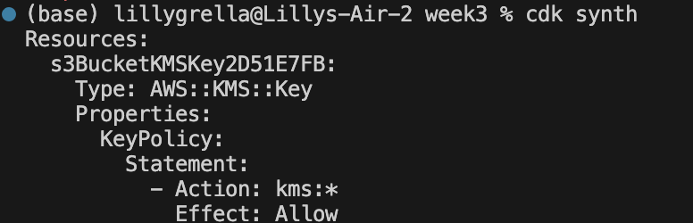
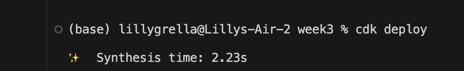
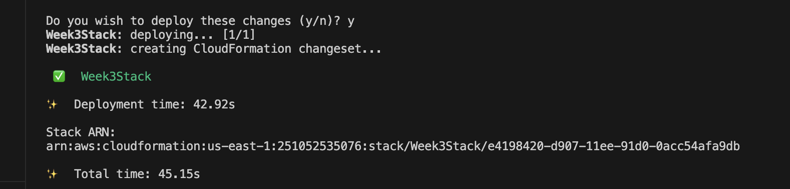
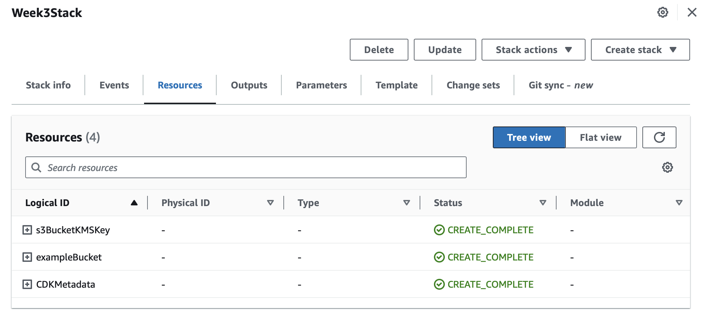
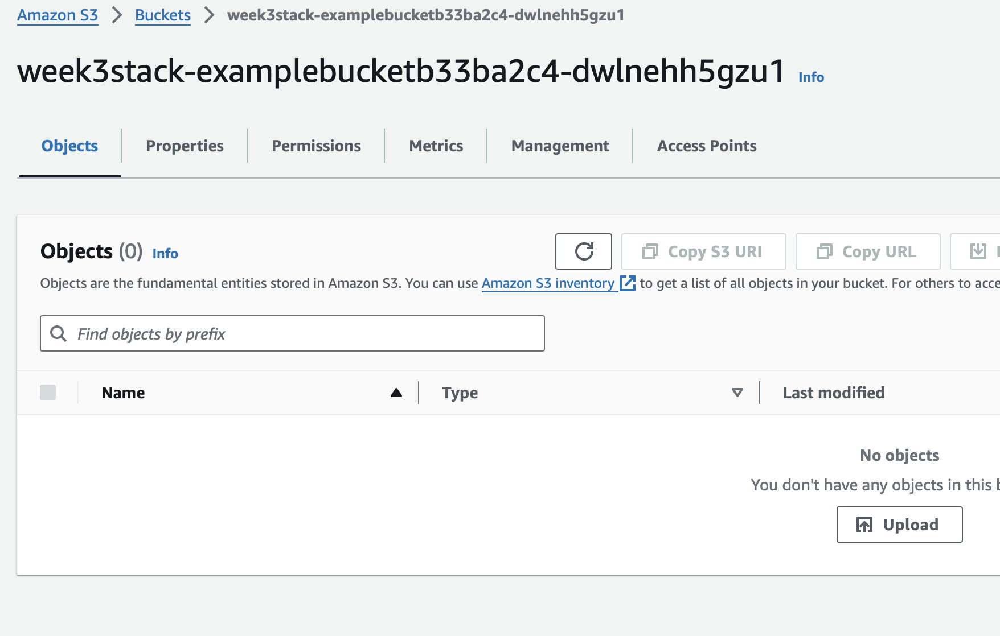
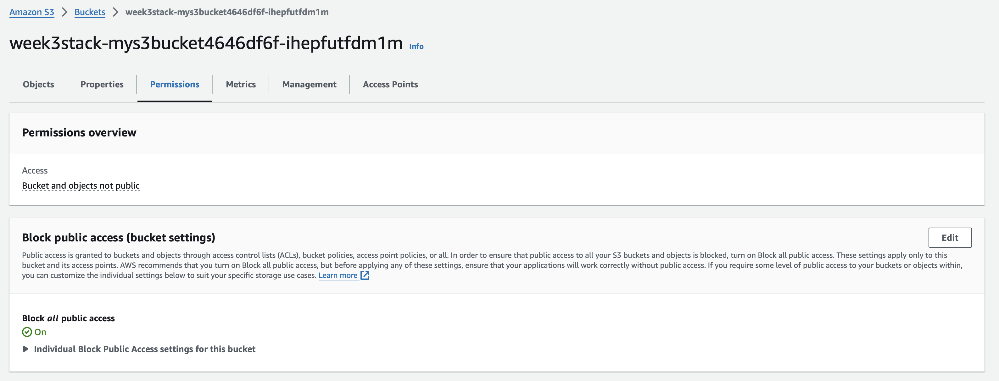
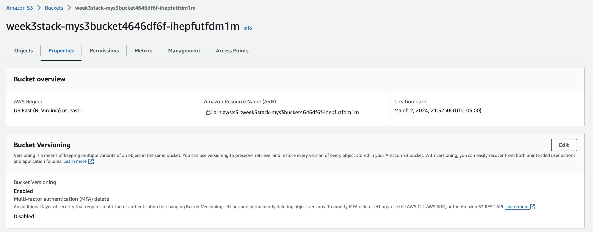

# Creating an S3 Bucket Using AWS CDK and Typescript

## Installation 
* Using NPM package manager in your terminal to install AWS CDK and Typescript: `npm install -g aws-cdk typescript`
* Confirm CDK is installed by Running: `cdk version`
* Confirm Installation of AWS CLI. If not installed, run `brew install aws-cli`
* Configure profile on CLI by providing access key and secret access key. To do so, run: `aws configure`
* Validate profile: aws sts get-caller-identity

## Generate a new CDK Project
* Using an empty repository, run: `cdk init {projectname} --language=typescript`

## Create an Amazon S3 Bucket construct in AWS CDK using code whisperer
* Create an instance of the S3BucketStack class
* I used codewhisperer to add settings to my S3 Bucket including: versioning, access control, and encryption.

## Deploying CDK Code to Create S3 Bucket
* run `cdk synth`. This generates cloud formation template
* To deploy to AWS, run `cdk deploy`

## Removing bucket
* If you are finished with a bucket, run `cdk destroy`

# Screenshots of this process

## Terminal

## Confirmation of creation

## Additional Permissions

